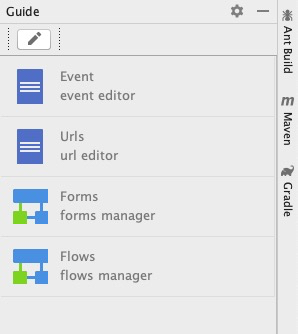
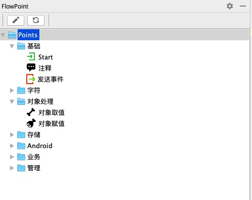

# ifelse
 android studio 辅助开发插件 
## 目标
    复杂业务可视化，减少代码中的ifelse
    UI与业务一体化集成，实现一个业务处理的连贯性
    生成代码可配置、模版化
    
    
    
    
## 基于事件驱动开发模式，集成页面管理、流程管理、业务流程绘制、代码模版。
    
    基于模版代码风格统一，模版语言为groovy。
    业务可视化绘制。

## 模块 （演示项目截图） [演示项目](https://github.com/fclassroom/wordspelling)
#### 1.事件定义  事件驱动

#### 2.页面管理  配置对应事件、类名、模版生成规范的基础代码。双击进入具体页面。
 
#### 3.流程管理  业务，双击进入具体流程编辑。

#### 4.流程实现 实现通用的流程节点，把这些节点按照画流程图的方式实现具体业务避免业务代码的编写,右键拖拽实现连线。双击查看节点实现。
 


### 在流程中定义变量
    $ 流程内可见变量   例如：$a,$b
    # 应用内静态变量   例如：#a,#b 
### 节点实现
    
    节点配置json
    {
        "classz": "org.ifelse.points.ObjectRead", // 实现类
        "icon": "/iedata/icons/arrayobj.png",     //节点图标
        "id": "500101",                           //唯一id
        "name": "对象取值",                        //对应名字
        "doubleclick": "R.open_point",            //双击后的处理
        "mproperties": [                          //输入输出配置 按照实现类进行配置 
            {
                "key":"data",
                "name":"data"
            },
            {
                "key":"field",
                "name":"field"
            },
            {
                "key":"value",
                "name":"value"
            },
            {
                "key":"descript",
                "name":"descript",
                "value": "对象取值"
            }
        ]
    },
    
    节点实现代码，通常为通用的输入输出处理
    public class ObjectRead extends FlowPoint {
    
        final static String key_data = "data";
        final static String key_field = "field";
        final static String key_value = "value";
    
        @Override
        public void run(FlowBox flowBox) throws Exception {
    
            Object obj = getVarValue(flowBox,key_data);
            String field = getVarString(flowBox,key_field);
            String value = getVarString(flowBox,key_value);
    
            String[] fields = field.split(",");
            String[] values = value.split(",");
    
            if( obj != null ) {
                Class classz = obj.getClass();
                for(int i=0;i<fields.length;i++){
    
                    Field ff = classz.getDeclaredField(fields[i]);
                    ff.setAccessible(true);
                    Object vobj = ff.get(obj);
                    setValue(flowBox,values[i],vobj);
    
                }
            }
    
            flowBox.next();
        }
    }
   
    
    节点配置数据
 
    
## 项目配置

  

    /iedata/project.json 配置基本数据  事件、页面管理、流程管理为默认数据。
        "editors"    编辑器
                {
                        "defPoint":"900101",     //默认实现节点及配置数据  points.json中定义
                        "descript":"forms manager",//显示名称
                        "name":"Forms",      //保存文件名
                        "type":"FLOW"    //TABLE,FLOW 表格数据，管理数据
                },
            
        "fieldTypes" 可选字段类型设置
                {
                    "name":"boolean",      //名称
                    "value":"true,false"   //值  
                },
                {
                    "name":"Event",
                    "path":"/iedata/Event.ie",  // 数据地址
                    "value":"id|name"           // 数据字段：数据及显示
                },
                		
        
    /iedata/points.json  配置流程节点
               
               配置节点组
               配置节点实现类、名称、图标、可配置项
               

#### 插件地址
[下载](./ifelse.zip)


### *License*

ifelse is released under the [Apache 2.0 license](license.txt).

```
Copyright 1999-2019 fclassroom Group.

Licensed under the Apache License, Version 2.0 (the "License");
you may not use this file except in compliance with the License.
You may obtain a copy of the License at following link.

     http://www.apache.org/licenses/LICENSE-2.0

Unless required by applicable law or agreed to in writing, software
distributed under the License is distributed on an "AS IS" BASIS,
WITHOUT WARRANTIES OR CONDITIONS OF ANY KIND, either express or implied.
See the License for the specific language governing permissions and
limitations under the License.
```