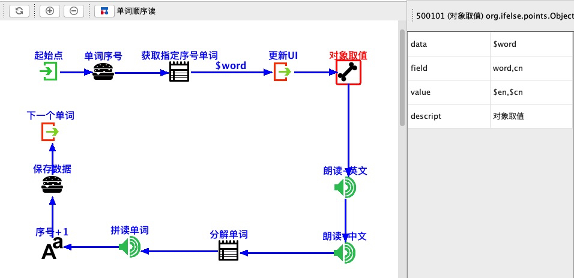

# ifelse
 android studio 辅助开发插件
## 基于事件驱动开发模式，集成页面管理、流程管理、业务流程绘制、代码模版。
    
    基于模版代码风格统一，模版语言为groovy。
    业务可视化绘制、UI与业务一体集成，实现一个业务处理的连贯性。

## 模块 （演示项目截图）
#### 1.事件定义  事件驱动

#### 2.页面管理  配置对应事件、类名、模版生成规范的基础代码。双击进入具体页面。
 
#### 3.流程管理  业务，双击进入具体流程编辑。

#### 4.流程实现 实现通用的流程节点，把这些节点按照画流程图的方式实现具体业务避免业务代码的编写。双击查看节点实现。
 

### 在流程中定义变量
    $ 流程内可见变量   例如：$a,$b
    # 应用内静态变量   例如：#a,#b 
### 节点实现
    
    节点配置json
    {
        "classz": "org.ifelse.points.ObjectRead",
        "icon": "/iedata/icons/arrayobj.png",
        "id": "500101",
        "name": "对象取值",
        "doubleclick": "R.open_point",
        "mproperties": [

            {
                "key":"data",
                "name":"data"
            },
            {
                "key":"field",
                "name":"field"
            },{
                "key":"value",
                "name":"value"
            },{
                "key":"descript",
                "name":"descript",
                "value": "对象取值"
            }
        ]
    },
    
    节点实现代码
    public class ObjectRead extends FlowPoint {
    
    
        final static String key_data = "data";
        final static String key_field = "field";
        final static String key_value = "value";
    
        @Override
        public void run(FlowBox flowBox) throws Exception {
    
    
            Object obj = flowBox.getValue(params.get(key_data));
            String field = params.get(key_field);
            String value = params.get(key_value);
    
            String[] fields = field.split(",");
            String[] values = value.split(",");
    
    
            if( obj != null )
            {
                Class classz = obj.getClass();
                for(int i=0;i<fields.length;i++)
                {
    
                    Field ff = classz.getDeclaredField(fields[i]);
                    ff.setAccessible(true);
                    Object vobj = ff.get(obj);
                    flowBox.setValue(values[i],vobj);
                }
    
    
            }
    
            flowBox.notifyFlowContinue();
    
    
        }
    }    
    
    节点配置数据
 
    

#### 插件地址
[下载](./ifelse.zip)