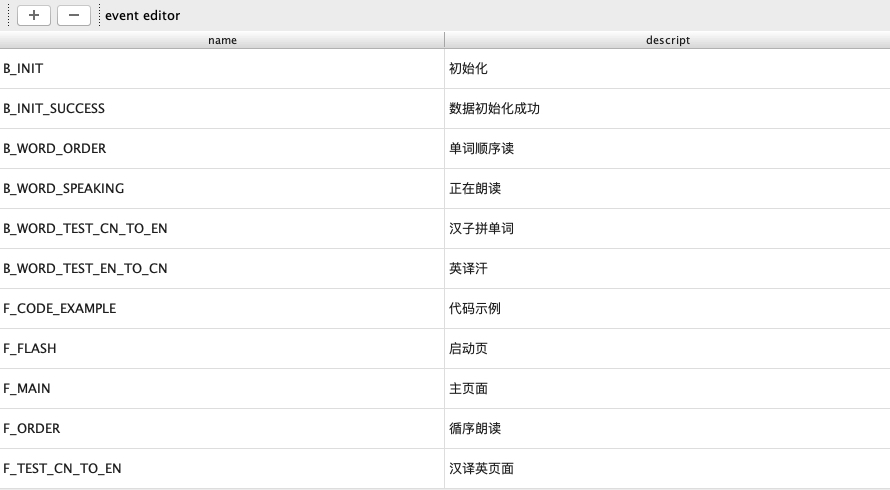
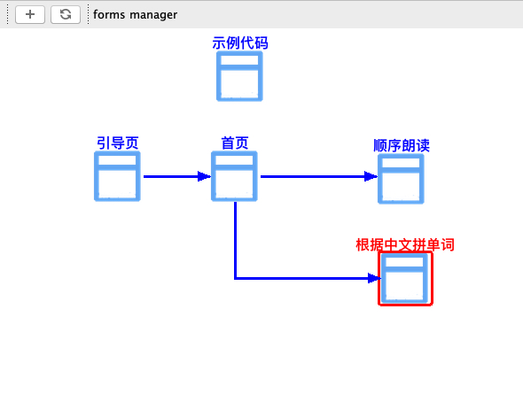
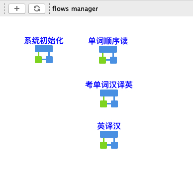
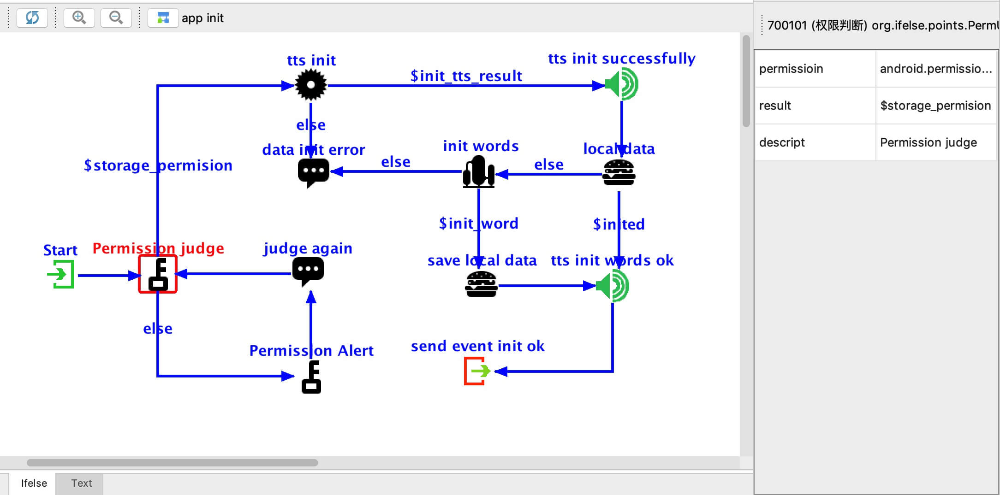

# ifelse
 android studio 辅助开发插件
## 基于事件驱动开发模式，集成页面管理、流程管理、业务流程绘制、代码模版。
#### 好处：
    基于模版代码风格统一
    业务可视化绘制
    UI与业务一体集成
## 模块 （演示项目截图）
#### 1.事件定义

#### 2.页面管理
 
#### 3.流程管理

#### 4.流程实现
 

#### 下载地址
[下载](./ifelse.zip)