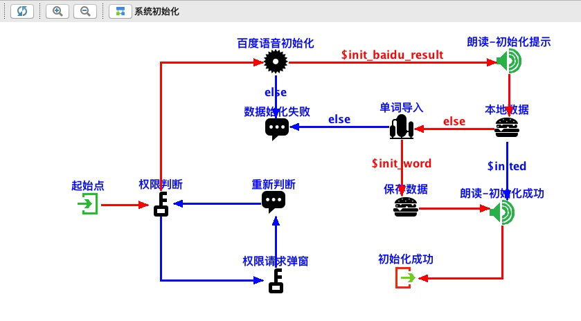
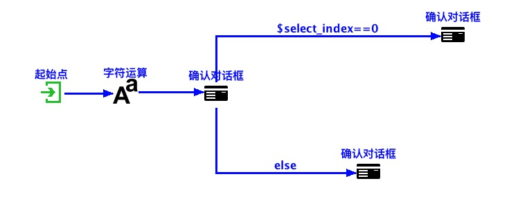
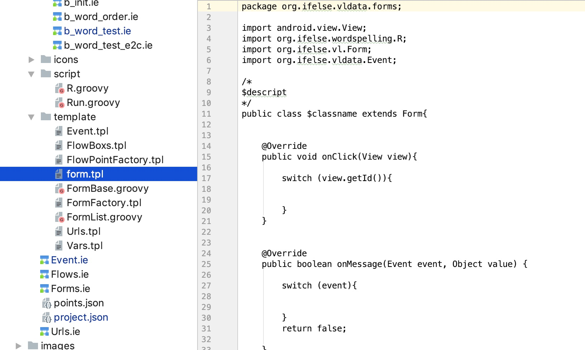
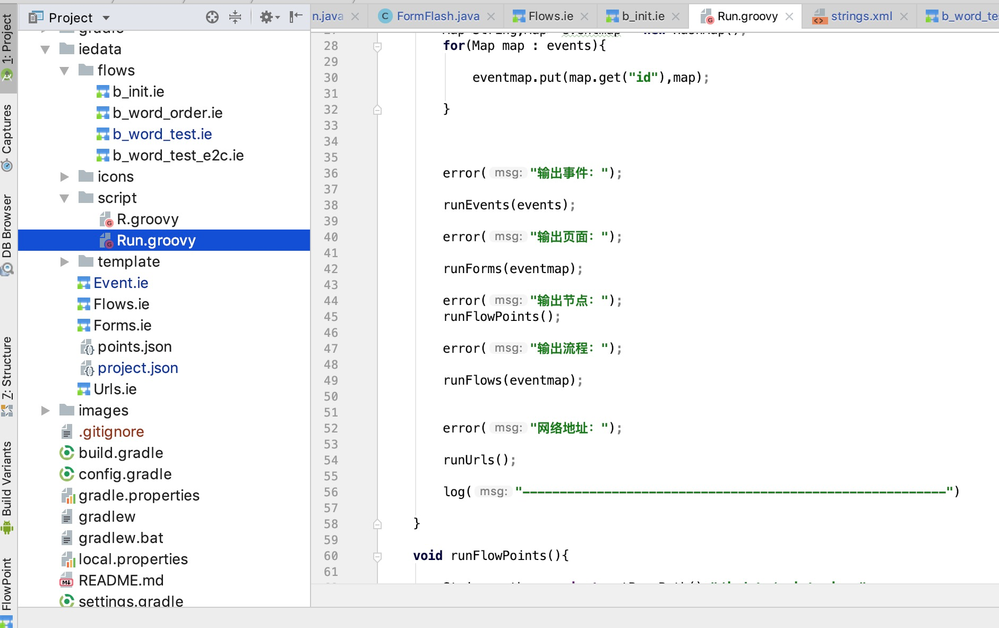
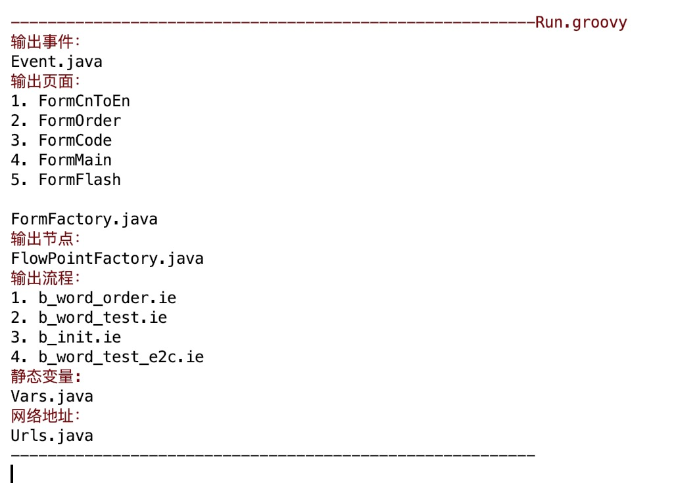

介绍一下项目中使用的android辅助开发插件
https://github.com/fclassroom/ifelse

 

    像这样一个流程大概要编写多少行代码？100行？流程有可能任意调整，中间加一些提示、等待，如何做到灵活修改？Rxjava、回调加判断、写详细注释便于以后维护？

    ifelse 这款插件可以帮你解决这些问题。把流程按照产品定义画出来，运行后一行代码进行调用。
    
    sendMessage(Event.B_INIT);
    
    当然这些通用节点是需要提前配置、实现的,把节点拖拽进流程图中配置。
    
    可以降低开发和后期维护成本。
    
配置好的节点 

### 使用辅助插件具体有哪些好处
    
    业务可视化绘制、UI与业务一体集成，实现一个业务处理的连贯性。
    复杂业务不用写代码，开发维护省时省力。
    页面统一管理便于查看整个项目的页面层次、结构、显示先后顺序、快速定位。
    流程统一管理便于定位业务处理逻辑。
    基于模版代码风格统一，模版语言为groovy便于扩展IOS等其他平台。
    
### 插件安装

https://github.com/fclassroom/ifelse/blob/master/ifelse.zip
   
### 演示项目下载

https://github.com/fclassroom/wordspelling
    
## 实现步骤
   
    1.安装插件 插件商店中搜索 ifelse 或者本地下载安装
    2.数据配置 /iedata/project.json
    3.事件定义 每个页面和流程都对应唯一事件。
    3.节点配置&实现
    4.页面配置  
    5.流程配置&业务绘制
    6.模版定义
    7.运行按模版生成辅助代码
    

### 查看项目引导
    
    

### 项目向导 事件、页面、流程编辑器
    

事件 事件驱动开发使模块、页面间耦合度降低 

页面 可配置页面事件、类名、模版。通过双击或选中后的属性按钮定位页面代码

    
流程 相关联流程拖拽到一起，通过双击或选中后的属性按钮定位具体流程实现。双击节点跳转可配置

 

流程实现

    流程起始点唯一
    通过拖拽加入流程。
    选中节点编辑节点输入输出属性。
    右键拖拽实现节点间连线。
    选中连线编辑节点跳转条件。
    通过双击或选中后的属性按钮定位节点具体实现类
    

流程调试、执行顺序查看。

    W/系统初始化-225921130: point(5)[0] 起始点 :Start
    W/系统初始化-225921130: Start params:null
    W/系统初始化-225921130: point(11)[1] 权限判断 :PermUtil
    W/系统初始化-225921130: point(27)[2] 百度语音初始化 :TTSInit
    W/系统初始化-225921130: [$init_baidu_result] is OK :true
    W/系统初始化-225921130: point(8)[3] 朗读-初始化提示 :TTS
    W/系统初始化-225921130: tts onSynthesizeStart:0
    W/系统初始化-225921130: tts onSpeechFinish:0
    W/系统初始化-225921130: point(38)[4] 本地数据 :UserData
    W/系统初始化-225921130: [$inited] is OK :false
    W/系统初始化-225921130: point(32)[5] 单词导入 :BWordImport
    W/系统初始化-225921130: [$init_word] is OK :true
    W/系统初始化-225921130: point(39)[6] 保存数据 :UserSaveData
    W/系统初始化-225921130: point(34)[7] 朗读-初始化成功 :TTS
    W/系统初始化-225921130: tts onSynthesizeStart:0
    W/系统初始化-225921130: tts onSpeechFinish:0
    W/系统初始化-225921130: point(45)[8] 初始化成功 :EventSend
    W/系统初始化-225921130: Event:B_INIT_SUCCESS
    W/系统初始化-225921130: flow is over. duration:7784
    
    
    拷贝 log 后 选择对应流程 ctrl + i 导入log
    显示执行顺序加快调试时间
  

在流程中定义变量

    $ 流程内可见变量   例如：$a,$b
    # 应用内静态变量   例如：#a,#b 
    
节点实现
    
    节点配置json
        {
            "classz": "org.ifelse.points.ObjectRead", // 实现类
            "icon": "/iedata/icons/arrayobj.png",     //节点图标
            "id": "500101",                           //唯一id
            "name": "对象取值",                        //对应名字
            "doubleclick": "R.open_point",            //双击后的处理
            "mproperties": [                          //输入输出配置 按照实现类进行配置 
                {
                    "key":"data",
                    "name":"data"
                    "args":""          //可以配置可选类型 boolean Event...定义在project.json :fieldTypes
                },
                {
                    "key":"field",
                    "name":"field"
                },
                {
                    "key":"value",
                    "name":"value"
                },
                {
                    "key":"descript",  //必选属性
                    "name":"descript",
                    "value": "对象取值"
                }
            ]
        },
    
    节点实现代码，通常为通用的输入输出处理
    public class ObjectRead extends FlowPoint {

    final static String key_data = "data";
    final static String key_field = "field";
    final static String key_value = "value";

    @Override
    public void run(FlowBox flowBox) throws Exception {

        Object obj = getVarValue(flowBox,key_data);
        String field = getVarName(flowBox,key_field);
        String value = getVarName(flowBox,key_value);

        String[] fields = field.split(",");
        String[] values = value.split(",");

        if( obj != null ) {
            Class classz = obj.getClass();
            for(int i=0;i<fields.length;i++){

                Field ff = classz.getDeclaredField(fields[i]);
                ff.setAccessible(true);
                Object vobj = ff.get(obj);
                setValue(flowBox,values[i],vobj);

            }
        }

        flowBox.next();
    }
}

含有UI交互的流程

模版编辑 实现代码统一、快速集成。
 

### 目录结构

    /iedata         插件数据目录
        /flows      流程目录
        /icons      图标目录
        /script     插件调用脚本目录
        /template   模版目录
        Event.ie    事件配置数据文件
        Flows.ie    流程管理文件
        Forms.ie    页面管理文件
        points.json 节点配置文件
        project.json 插件配置文件
    src/..../vldata  模版生成文件
    src/..../vl      框架文件
    src/..../points  通用节点实现目录
### 运行

运行log
    

## 总结

    1.整个插件需要了解的东西还是很多，通过示例项目入手最为方便。
    2.实现了页面、复杂业务的可视化管理。
    3.在复杂业务调整过程中完全可以和产品一起画流程，避免沟通理解问题造成的不一致。
    4.项目的迭代维护成本降低，节省开发人员了解阅读代码时间。
    5.都是按照模版生成代码，所以可以任意修改模版生成适合自己项目代码。
    
    

    

